# Mechanical Keyboard on Mac with simple backlight 
This is an example for building a custom mechanical keyboard from scratch. I use it on a Mac, but there is no hardwired difference to a PC keyboard. I even kept the keymapping, because Mac OS can switch the Command and Option keys natively. 
Besides the technical side, I'll also write about my experience with manufacturers and stores, where I got all the parts. I also made a few beginner mistakes, which other beginners can avoid by reading this. This whole story is written for beginners.
  

I've built 2 keyboards with the same layouts but different components.   
1.) Cherry MX Brown Switches, Custom printed keycaps, green LEDs, black / transparent acrylic case 
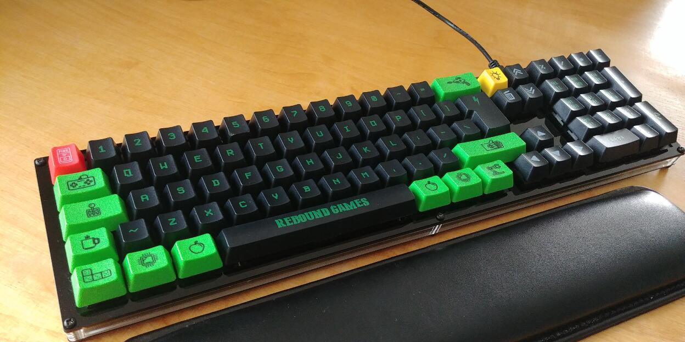 
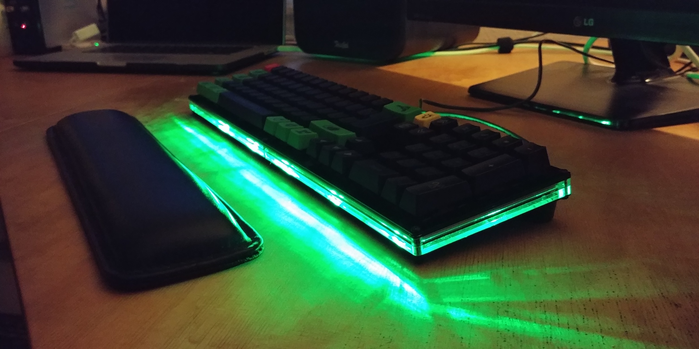 
 
2.) Gateron Black Switches, chrome- and bronze sprayed keycaps, fully transparent acrylic case and amber LEDs 
 

<b>Crash Course</b> 
There's a phenomenal guide on how to build a keyboard here: https://github.com/ruiqimao/keyboard-pcb-guide  
If you don't have a clue yet, and have to start from the very beginning, then that's your starting point. I did it as well, because I had no idea from anything when I started. Through this guide I learned what components are needed to build a mechanical keyboard, what techniques / software is used to design electronic circuit boards, and a lot about electronics in general. Without this guide, I'd have never started.  

<b>Layout Creation</b> 
First, get an idea of how your keyboard should look like: http://www.keyboard-layout-editor.com 
This is mine: <a href="http://www.keyboard-layout-editor.com/#/gists/c6ae22aae21851b44d510154a7a343f7">Migouner</a>
 

 
<b>Schematic</b> 
I did mostly everything like in the keyboard-pcb-guide tutorial. But I needed a different microcontroller, because I wanted to build a bigger keyboard with 85 keys. So with all rows and columns, I needed a total of 27 input pins for the matrix. Because QMK's firmware is used to flash the MCU, I took the one supported by QMK - AT90USB1286. It has a total of 48 input pins, so more than enough for Matrix and LED control pin.  
This is an overview of the board. Separated in 3 parts. LED circuit, keyboard matrix and the MCU section.  
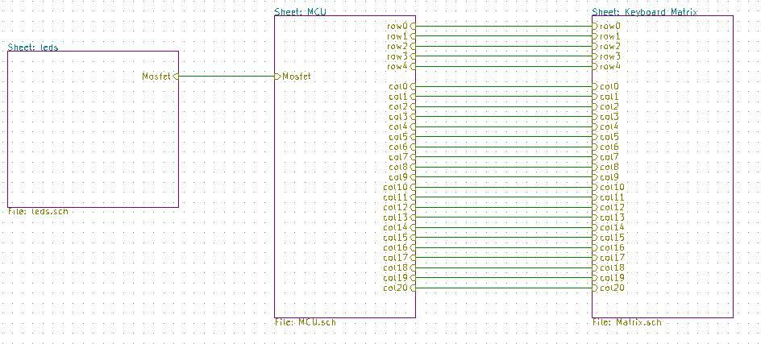  

Matrix and MCU circuit: 
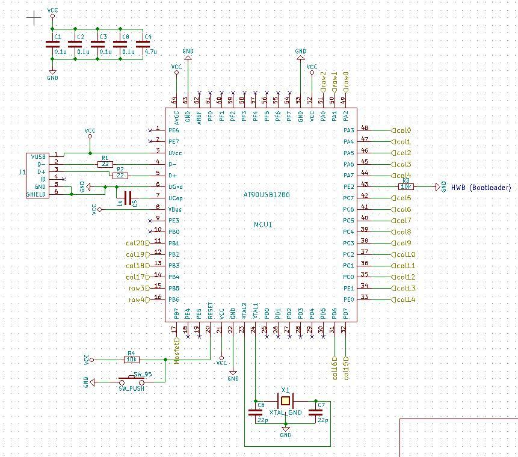 
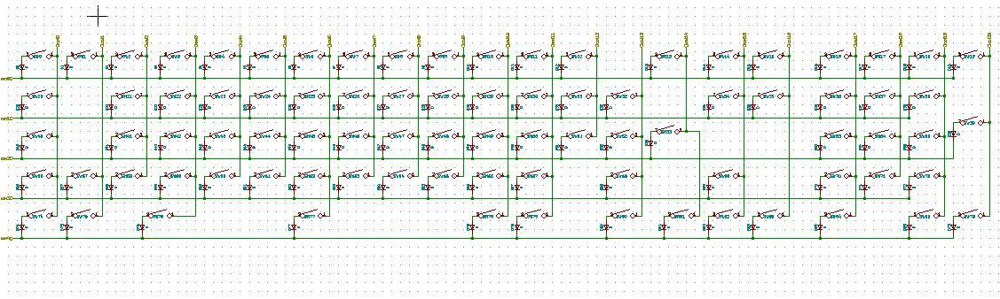 
 
For the matrix, I just looked at kbfirmware.com, the QMK firmware generator. I connected the keys in the schematic above exactly like the firmware tool defined my cols and rows: 
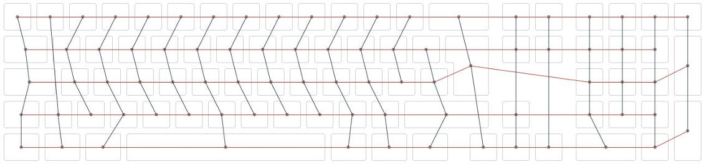  

Aditionally the LED's for the backlighting: 
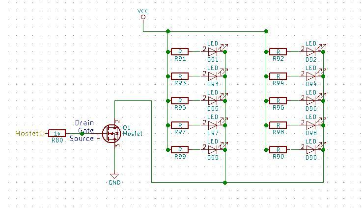 
 

<b>PCB design</b> 
Normally you'd have to draw the PCB all by yourself, for all keys you have! I however, used a python script from here: https://github.com/ahtn/keyboard_case_and_pcb_gen 
You need the json output from KLE for this script to work. With this it generates a finished layout for all keys on the board. Then you have to put in everything else, MCU, diodes, resistors etc...  

But there are a few steps to get it working (on a mac). You need Homebrew and a lot of libraries, only then you can execute the script without getting an error: 
brew install pip3 python3 
pip3 install nose tornado solidpython numpy scipy kle pyparsing pyaml 
git clone https://github.com/ahtn/keyboard_case_and_pcb_gen . 
 
Download json from KLE and then execute: 
plate.py keyboard-layout.json 
  
By the time I needed to troubleshoot this script, I could have drawn the PCB already (now). But when I started, I didn't have any experience with KiCAD, and had no idea of positioning the keys, defining footprints etc...so I thought it would be easier to run a script.  

I'd also recommend, looking at the keyboard_example.py script in the python folder here. Because after importing your netlist into PCBnew, all existing pieces are on top of each other. So you have to click and drag each one to it's physical place on the board. Especially for the diodes, that can be frustrating, because you have to do this for every switch. That's what I wrote the python script for.  
After all, this is my result: 
  
You can use the silkscreen to print your own logo or text on the board. Kicad layers: F. Silk = Front Side, B. Silk = Back Side 
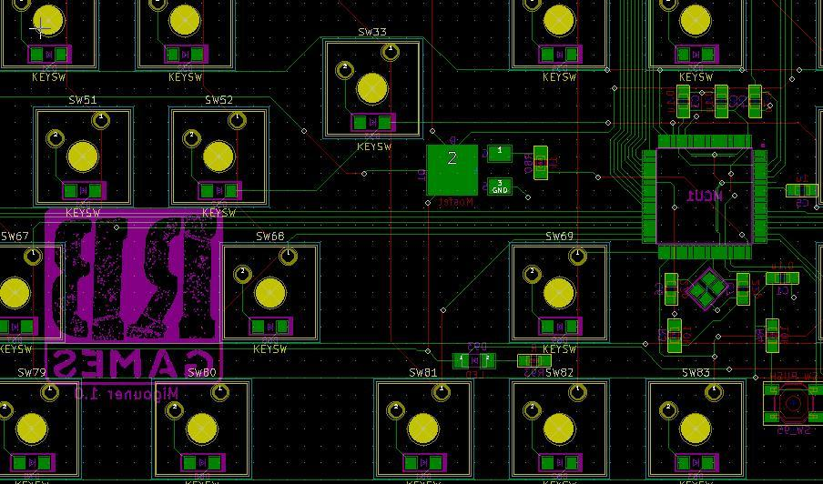  

<b>PCB Production</b> 
After comparing a few manufacturers, I let it made at easyeda.com. You get an online quote immediately after uploading your Gerber files, and it was a very good price. But I ran into a massive delay because the german customs office. More in the mistakes section below. But the quality was perfectly fine. As I'm writing this, I already made 3 orders there, all of them were really well done and also cheap, compaired to other manufacturers.  

<b>LED's for backlight</b> 
This is not as easy as it might sound like. An LED has about 2,1 - 2,3 Volts. Powering a single one with an Output pin of an Atmel Microchip is not a problem. Powering multiple LEDs needs a transistor for taking over the extra power. I took a MOSFET for that. (Before I started this project, I had no idea what a MOSFET is, or how an LED Circuit is powered. If you want to learn this, https://www.tinkercad.com/circuits is a great source for getting in touch with electronics (virtually).  

That turned out helpful, but I wanted to be 100% sure about this. The last thing I wanted, was that my keyboard burned to dust. So I got a cheap Arduino Uno (16&euro; with a lot of extras), also 2 extra MOSFETs from Amazon, and built up this scenario:  
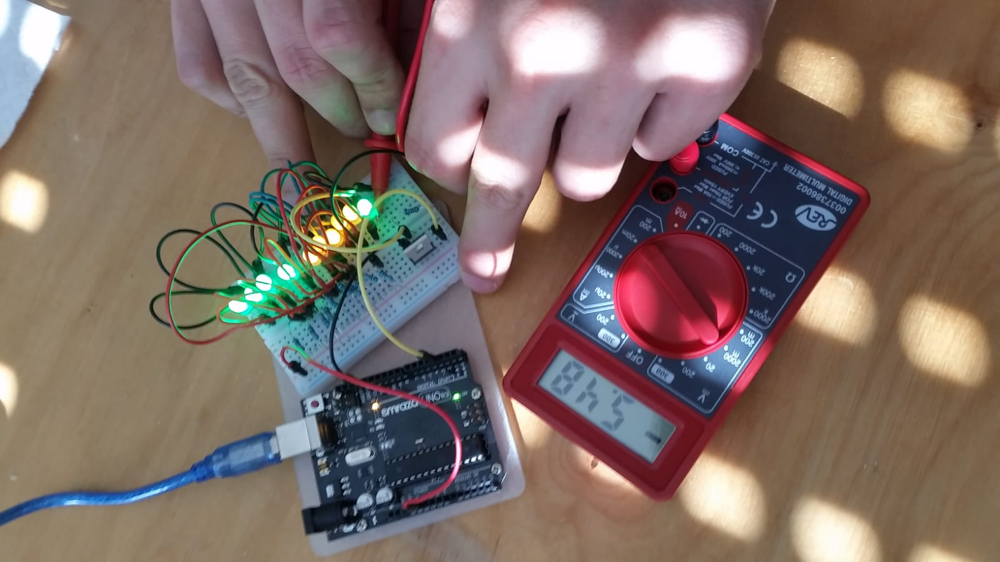 
There were only 330 Ohm resistors in the package, resulting in 5.5 mA going through each LED. I wanted about 8 or 9 mA for appropriate brightness (USB 2.0 can handle up to 500 mA in total). so I calculated here what I needed: http://tinyurl.com/y8kq7h9s 
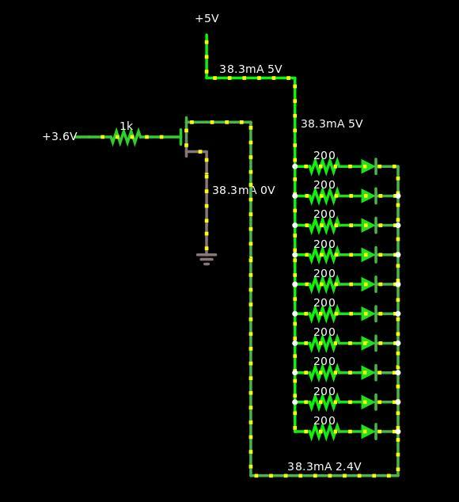 
Source: http://www.falstad.com/circuit/ (Also a great electronics simulator) 
 
200 Ohm resistors seemed fine for me. To wrap this up: The MOSFET is there because it takes power directly from the source and can handle a big amount of current. The gate controls the amount of current going through the transistor, controling the brightness of the LEDs. Therefore gate is connected to a PWM (Pulse Width Modulation) pin on the MCU. The special thing about this particular transistor is, it doesn't need current at the gate - only Voltage. This protects the Atmel chip and it's PWM pin. This circuit is in parallel mode, so these single color LED's cannot be controlled separately. It should be as easy as possible to build. 

 
<b>Components</b> 
I've ordered everything at Digikey.com. But I recommend would read the shipping faq's carefully. I explain why in the mistakes secion below. Another good choice is mouser.com, it's the same great choice and filtering mechanism. 
One shitty thing though, shipping is very expensive (in both stores). So either you pay 20$ for shipping, or order something for more that 60$, in which case shipping is free. At least to Germany. So here's my component list:  
<table>
<tr><td><b>Quantity</b></td><td><b>Description</b></td></tr>
<tr><td>1</td>		<td>MCU AT90USB1286</td></tr>
<tr><td>10</td>		<td>RES 200 OHM 1% 1/4W 0805</td></tr>
<tr><td>1</td>		<td>CRYSTAL 16.0000MHZ 18PF SMD</td></tr>
<tr><td>1</td>		<td>CAP CER 1UF 16V X7R 0805</td></tr>
<tr><td>100</td>	<td>DIODE GEN PURP 100V 150MA SOD123</td></tr>
<tr><td>10</td>		<td>RES 22 OHM 5% 1/8W 0805</td></tr>
<tr><td>1</td>		<td>CAP CER 4.7UF 25V X5R 0805</td></tr>
<tr><td>1</td>		<td>SWITCH TACTILE SPST-NO 0.05A 12V</td></tr>
<tr><td>1</td>		<td>CONN RCPT MINI USB2.0 5POS SLD</td></tr>
<tr><td>2</td>		<td>CAP CER 22PF 50V C0G/NP0 0805</td></tr>
<tr><td>4</td>		<td>CAP CER 0.1UF 50V X7R 0805</td></tr>
<tr><td>10</td>		<td>RES 10K OHM 5% 1/8W 0805</td></tr>
<tr><td>2</td>		<td>RES SMD 1K OHM 0.1% 1/8W 0805</td></tr>
<tr><td>10</td>		<td>LED GREEN DIFFUSED 1206 SMD</td></tr>
<tr><td>1</td>		<td>MOSFET N-CH 30V 58A DPAK</td></tr>
</table>

 
<b>Switches and Stabilizers</b> 
I made the black board with Cherry brown switches, and the transparent one with Gateron black switches. You'll find a lot about switch types yourself, so I won't go into detail here. Interesting was that Gateron costs only half the price of Cherry. It claims to be the same, though. So I wanted to try out both of them. Same goes for stabilizers. Cherry stabs are more expensive than Costar. I used Cherry stabs for the Cherry switches and Costar for the Gateron switches. Good place to find stuff like that is at <a href="https://www.switchtop.com/">Switchtop</a>. 
Also a tube of Superlube is recommendable, greasing the stabilizers makes them go more smoothly.  
Important: PCB mounting is different from plate mounting. It changes your whole build. Stabilizers and switches are different, the PCB needs another design for drill holes etc, and the mounting plate's switch holes can be different. So be sure which mounting style you want. I went with plate mount, because more stability - the typing pressure is taken by the metal plate instead of the PCB, also fewer drilling holes on the PCB. If your PCB was made for PCB mount, it can also be used for plate mount. Not the other way. 

 
<b>Keycaps</b> 
For the black Rebound Games keyboard, I made custom keycaps at <a href="http://www.maxkeyboard.com/">MaxKeyboard</a>. They got templates for vector software, I use Inkscape. There are some limitations with the colors, but that was fine for my design. So I uploaded my Inkscape file and ordered the key set. Prices for custom printed key sets start at only 20$, so I could live with the color limitations. 
What wasn't so nice, some keys were slightly damaged. Looked like burn marks on the edges, but still fully functional. At least the printing was good.
  
For the second one I've ordered the cheapest keyset I could find on ebay, about 10&euro;. I sprayed them in bronze and chrome colors. In combination with the fully transparent case and the amber LEDs, it should get a futuristic style. 
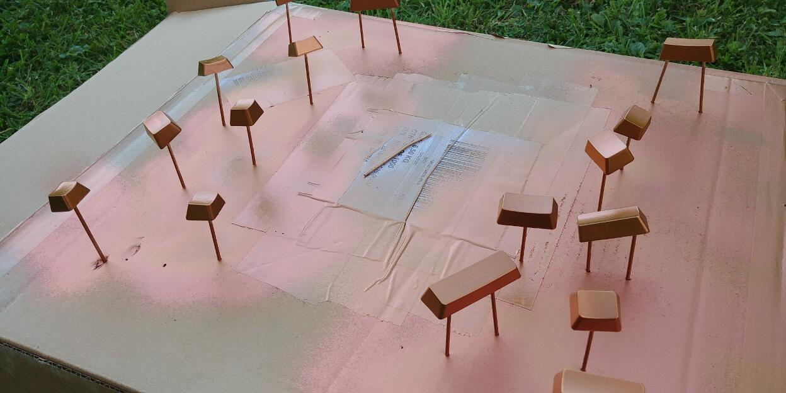
 

 
<b>Lasering a sandwich case</b> 
A very handy tool and also your starting point for case design: <a href="http://builder.swillkb.com/">builder.swillkb.com</a> 
It creates all parts of a sandwich case keyboard, you just have to put in your layout from keyboard-layout-editor.com, and adjust the settings, it's well documented. 
<ul>
    <li>Mounting plate 
    For most plate mounted MX switches, the plate must be exactly 1.5mm thick. I let it made at <a href="https://www.laserboost.com/">Laserboost</a> in Barcelona and chose natural carbon steel as material. It was the cheapest metal, and I wanted to spray it another color anyway. So I didn't care about finishing. I was super satisfied with the end result!  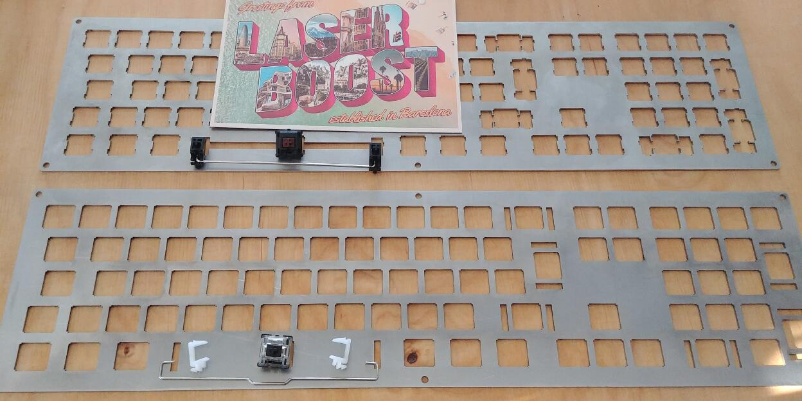   One plate hat holes for Cherry switches only, the other one for Gateron switches and Costar stabilizers.
    </li> 
    <li>Acrylic case 
    For top-, bottom- and open layers, I found reasonable prices at local companies in Germany. Because I found all the online services for lasercutting acrylic plates way to expensive. The two open layers are 5mm thick each, transparent acryl. Very solid, as it should be. Top- and bottom layers are 1mm each, black acryl. The second keyboard got transparent VIVAK material for top and bottom. It's like acryl but cheaper, I wanted to give it a try. The 1mm plates look fine, but are pretty wobbly. I thought they would be as hard as the thicker plates, but never mind. They don't have to carry something, so it doesn't matter. 
    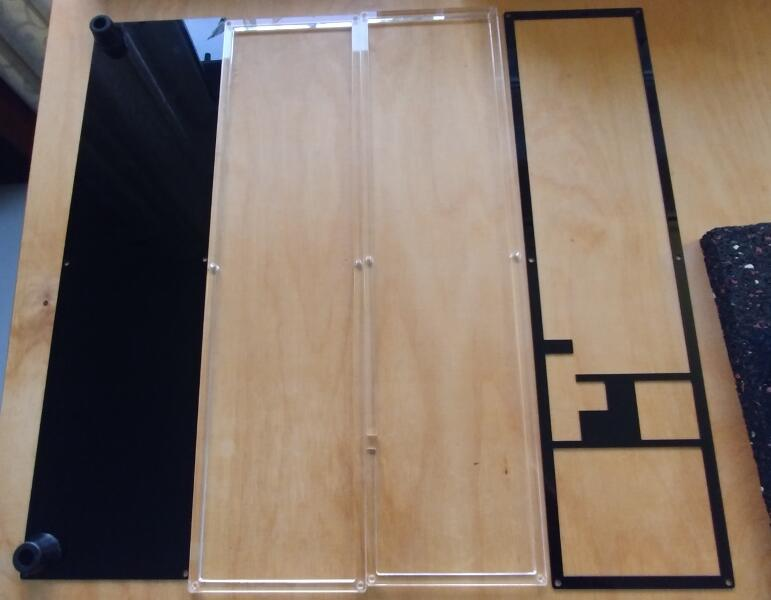
    </li> 
    <li>Screws 
    My edge padding on the case is 7.4mm. That's the distance from the keys to the border of the case. In the middle of the padding, there are holes for screws. I made 6 in total. Diameter is 3.5mm, needed for M3 screws. It fits perfectly. On the bottom I used nut covers to fixate the screw. It also serves as a nice bottom foot for the keyboard. Finally I glued some rubber feet on the bottom, to get the right typing angle.
    </li> 
</ul>

 
<b>Soldering and assembling</b> 
If you never soldered SMDs (Surface Mount Devices), I highly recommend a practise pcb before start soldering your board. I bought one for 2&euro; on ebay. Also check out youtube tutorials on how to use Flux, or solder SMD, Microchips etc... You definitely need some magnifier as well, at least for controlling after soldering. I also have a magnifying headset for soldering. Because the chips's pins or the 0805 components are just pretty damn small. 
Best is to start with all components EXCEPT for the diodes and switches. A basic setup to make your computer recognize the chip when plugged in. This way you can react to issues at an early stage. And there can be issues! See mistakes section. 
If you built the board correctly, you will see a new USB device after plugging it into an USB port on your computer. It's named after the chip in the device manager (Windows), or on Mac "About this Mac" -> "More info". 
If you see your device there, you're good to go. If not, grab your multimeter for troubleshooting. 
 
Especially the diodes only work if the polarity is right. They cannot be the wrong way round. Everything else (besides the MCU and LEDs) can be either way. Capacitors, resistors and even the crystal. 
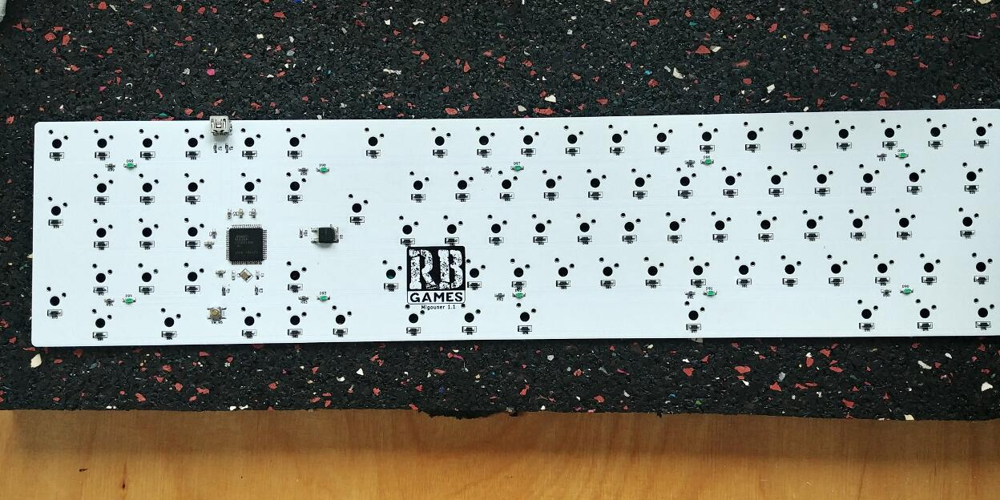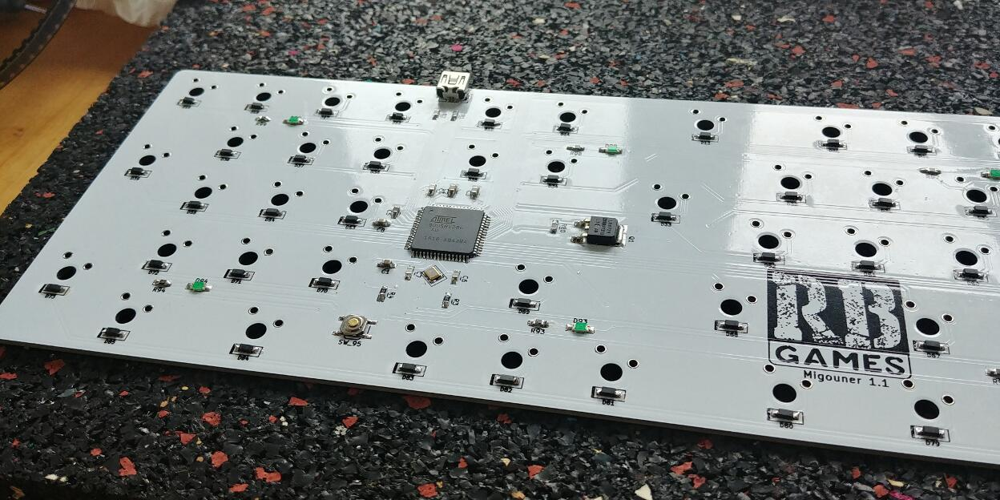 
Once done soldering all components, the stabs and switches can be put in. First the stabs! Then some switches at the corners for fixating the plate on the PCB. If it fits nicely, all the other switches can be assembled and soldered as well. 
 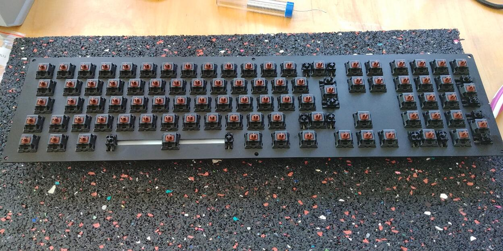 
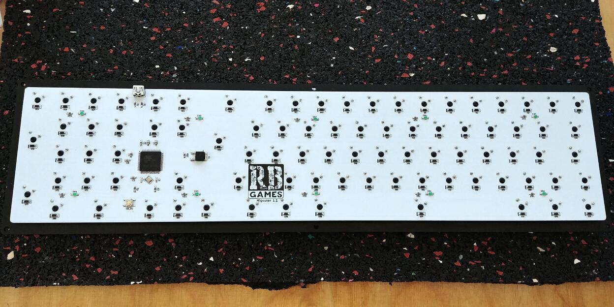 
I sprayed the metal plate with a matt black color, it looked amazing afterwards! After the board is soldered and assembled to the mounting plate, all switches and stabs are in, the case can be screwed together and the keycaps put on. 

 
<b>Firmware</b> 
I chose <a href="https://docs.qmk.fm">QMK firmware</a>, which is a great open source firmware for mechanical keyboards with lots of interesting features. Including backlight, key macros, debug mode etc... 
Your keyboard can be configured easily within the browser <a href="http://kbfirmware.com">kbfirmware.com</a>, things like keymap, pin mapping for the matrix, macros, basically everything. You don't have to write code at this point. 
After configuring, you can either download the hex file and flash it to the chip directly, or download the source code via zip file, and build the hex file yourself. That's what I did, because this way I could also customize the USB device Vendor and Version (in config.h), which you see in your device manager. Everything from building to flashing is well documented in the QMK docs. But there is something to take note of, below in the mistakes secion. 

 
<h3 id="mistakes">Mistakes</h3> 
Ok here are some beginners mistakes, some were annoying, some stupid and some not hard to fix. I hope it help avoiding such things.
<ul>
    <li>Ordering with DHL 
    DHL scammed me so hard. I chose DHL for shipping, not UPS. So it arrived at the customs office in Leipzig, I got an email saying: Do you want us to ship the package? If you're a reseller, it would cost you extra fees. I said no, I order as a private person, and also paid the order as one. They looked at my 100 diodes position and asked me, why would you order 100 pieces of something? You must be reselling those...So I had to explain them why I would need 100 diodes! At some point they believed me and were willing to ship it. I asked the person on the phone if it would cost me something, taxes, fees etc...? If so, I do NOT want the package to be delivered. They said no, it does NOT cost anything, and shipped it. 4 weeks later I got a letter from DHL in cooperation with customs, forcing me to pay 40 Euros!!! for DHL "services"! What services please? It was free shipping you bunch of criminals! So i bought at Digikey for 5016&euro; (FREE SHIPPING), and DHL rips 4016&euro; off my face. And you can't do shit about it. If you deny the payment, you get extra fees on top of it. 
    Next time I ordered with UPS on a Friday, on Monday I had it. And NO extra fees! So never trust DHL, don't believe a single word they say. And if you order there from another continent, record every phone call and get yourself very good lawyers!    
    </li> 
    <li>PCB 
    On my first attempt, I didn't get the computer recognize the device. It just nothing happend after plugging into different USB ports. But power on all the SMD components seemed fine after measuring with my multimeter. In the end, it was wrong PCB design! I didn't connect the VBus pin of the Microcontroller! That was incredible stupid because this pin is responsible for registering an USB device on the computer. Not only that, but on this pin there must be a capacitor, which I also didn't consider. So this was my try to fix it: 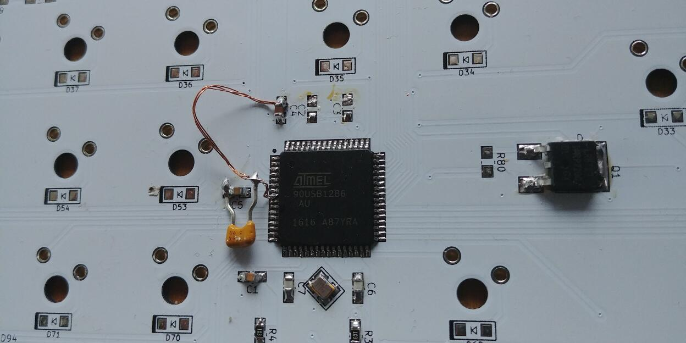 I bridged a capacitor to the pin. Of course it didn't work and i threw away all 5 PCB's! 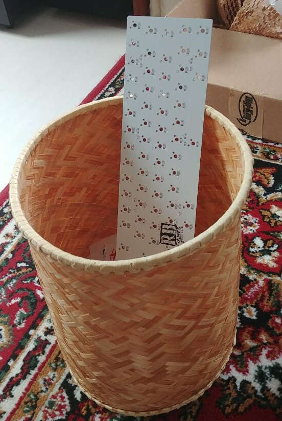 At least I could keep the components and reuse them on the next board.  
    </li>
    <li>Hint 
    If you want to save money, it maybe a good idea to start small. This way you won't fail at the end product like I did. I had to order this PCB twice, second time with the VBus corrected. For 2$ you can design a little board like this and try it out, get used to micro chips and how they work. For me it worked right after soldering.   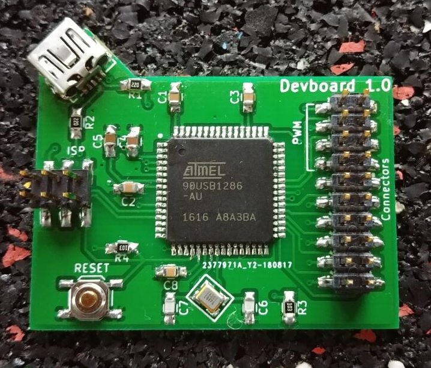 I then connected some LEDs and switches from my Arduino and flashed QMK firmware on the chip. To make a 4 key keyboard. It worked perfectly fine. 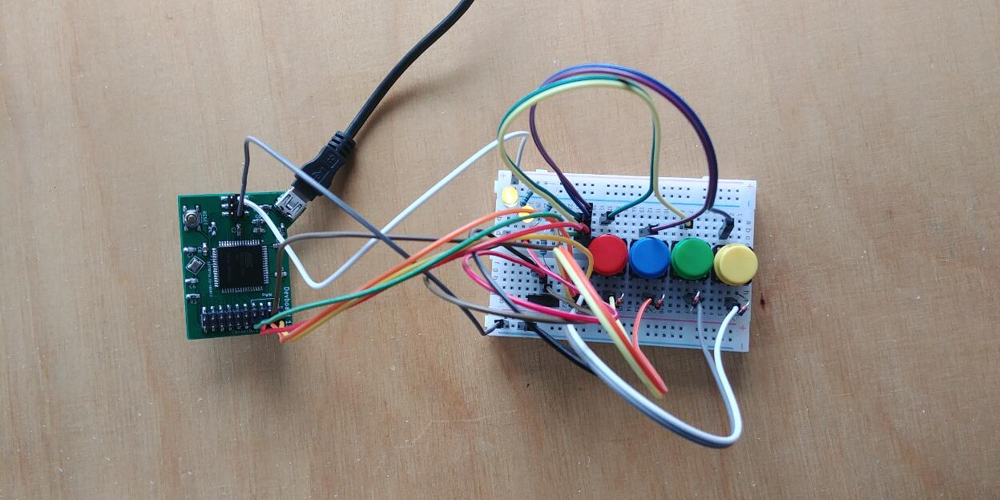  At this point I was sure what I'm doing, and ready to spend more money for the next keyboard PCB. 
    </li> 
    <li>Stabilizers 
    I've ordered PCB mount stabs for cherry by mistake, should have gone with plate mount stabs. Just clipping them doesn't help, they don't fit at all. So I had to order new stabs. 
    </li> 
    <li>LEDs 
    The LEDs I've ordered were too weak. They almost didn't illuminate at all. Turns out they were "Indication" LEDs. What I needed though, were Illumination LEDs. I didn't know which parameter in the datasheet actually stands for light intensity, and found that "mcd" is the one (Millicandela). The LEDs just had 8 mcd, which is close to nothing. Then I've ordered some other LEDs on ebay for 216&euro;. They had about 550 mcd and were nice and bright! They are on the picture at the top, the green ones. 
    Of course they had to be of the same current (20mA) and mounting type 1206. 
    </li> 
    <li>Firmware 
    QMK is awesome. I just found 2 issues: 
    If you download the zip file directly from the firmware builders website, you cannot compile it. Because the codebase on the website is too old. A workaround is to download the git repository from qmk - it's documented in their docs - take your keyboard's directory from your zip file (not the other files), and put it into the QMK repo you've just cloned with git, also into the keyboards folder. Rename the folder to ["your keyboards name"]. Just like all other folders in there. 
    Then you can build the hex file with this command: make ["your keyboards name"] 
    Then it still won't work, saying some event function cannot be found. Just delete the whole funtion from your keymap.c file and it should run. 
    Also the loop for the backlight breathing was not correct, it flickered and then restarted every time, looked strange. It must be fixed in quantum/quantum.c.  
    </li> 
</ul> 
 
That's all I have to say about it. It was not cheap but I learned very much about electronics, PCB's, microcontrollers... and got an ass kicking keyboard now, which I use every day and indeed became my favourite one! So I feel like it was worth it :-) I hope it helps you guys who also want to start building a keyboard. Have fun!